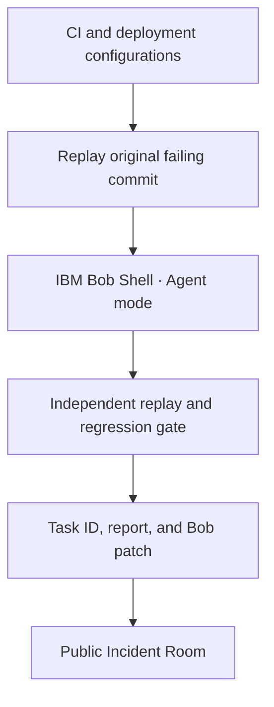

# EnvReplay

### A deployment failure CI cannot see. A Bob repair you can verify.

[**Open the Incident Room →**](https://harshapriyag123.github.io/EnvReplay/) · [**Inspect the real Bob run →**](https://github.com/harshapriyag123/EnvReplay/actions/runs/36223374110) · [**Read the evidence →**](evidence/bob-run-6/report.md)


EnvReplay starts with one reproducible problem: a small Python service passes CI at `/api/health`, but deployment adds `/service` to the public route. The original server does not handle that prefix, so the deployed health check returns **404**. IBM Bob Shell investigates the failing revision in Agent mode and produces a focused patch. EnvReplay independently reruns the same checks, preserves Bob's diff and task ID, and displays the evidence in a public interface.

## The incident

| Profile | `public_base_path` | Requested route | Before repair | After Bob |
| --- | --- | --- | ---: | ---: |
| CI | `""` | `/api/health` | HTTP **200** | HTTP **200** |
| Deployment | `"/service"` | `/service/api/health` | HTTP **404** | HTTP **200** |

The values above come from [sanitized configurations](config/) and [actual HTTP replay output](evidence/bob-run-6/report.json). The regression suite also catches the deployment failure. The service and replay make real local HTTP requests on ephemeral ports; this is not a simulated status display.


## How the system works



1. **Reproduce.** `bob_workflow.py` checks out the [original failing commit](https://github.com/harshapriyag123/EnvReplay/commit/847f33f7ad3bc3fadbae125e12789e8e097040f0) in an isolated Git worktree. It runs both HTTP profiles and the regression suite, and requires CI to pass while deployment and regression fail.
2. **Investigate and repair.** The runner gives Bob the actual failing output plus repository and configuration paths. Official IBM Bob Shell runs in Agent mode with bounded cost and turns. Bob changed `app.py` to serve the health route under the configured base path and `replay.py` to pass that configuration into the server.
3. **Verify independently.** After Bob finishes, the runner executes the same commands in Bob's worktree. A Bob success response alone does not pass: Bob must change files, and every check must exit 0. The patch is saved, never pushed or merged automatically.
4. **Inspect.** `site/build.py` copies only allowlisted, sanitized configuration and run evidence into `docs/data/`. The [Incident Room](https://harshapriyag123.github.io/EnvReplay/) reads those files, checks that the recorded outcome is internally consistent, and provides replay, side-by-side comparison, patch, verification, and raw-evidence views. The public site displays an archived run; it does not invoke Bob or execute Python in the browser.

### Real run #6

IBM Bob Shell task [`0a1c9ea43c93eb037a283ffe760d0825`](https://github.com/harshapriyag123/EnvReplay/actions/runs/36223374110) completed successfully. Independent checks produced these exit codes:

| Check | Command | Before | After Bob |
| --- | --- | ---: | ---: |
| CI | `python3 replay.py --profile ci` | 0 | 0 |
| Deployment | `python3 replay.py --profile deployment` | **1** | **0** |
| Regression | `python3 -m unittest -v` | **1** | **0** |

[Before output](evidence/bob-run-6/before.json) · [Complete report](evidence/bob-run-6/report.json) · [Readable summary](evidence/bob-run-6/report.md) · [Bob-generated patch](evidence/bob-run-6/bob.diff)

**Attribution:** The reference repair already on `main` was authored by Codex at the owner's request. Bob Shell independently repaired the original failing commit in an isolated worktree during run #6. The two repairs must not be conflated; the Bob patch is preserved as evidence and has not been merged into `main`.

## Reproduce on a development system

Python 3.10+ is sufficient for the sample service and Incident Room. From the repository root:

```sh
python3 replay.py --profile ci
python3 replay.py --profile deployment
python3 -m unittest -v
python3 bob_workflow.py prepare
python3 site/build.py --check
python3 -m http.server 8000 --directory docs
```

Open `http://localhost:8000/` for the evidence viewer. The current `main` checkout should pass both replays and all four regression tests. `bob_workflow.py prepare` independently recreates the failing baseline in a detached worktree and saves `bob_runs/latest/before.json`; it does not run Bob or change `main`. `python3 demo.py` presents the preserved original failure beside live checks on the current checkout.

To rerun Bob's isolated repair, install [official Bob Shell](https://bob.ibm.com/docs/shell/getting-started/install-and-setup), configure an **Inference** API key privately as `BOB_API_KEY`, review and accept IBM's license in your session, then run:

```sh
python3 bob_workflow.py run --max-cost 1.0 --max-turns 12 --accept-license
```

The runner writes `report.json`, `report.md`, `before.json`, and `bob.diff` under the ignored `bob_runs/latest/` directory. GitHub Actions provides the same bounded experiment through [Bob repair experiment](.github/workflows/bob-repair.yml): add `BOB_API_KEY` as a repository **secret**, and explicitly accept the license when dispatching. Never commit the key, its downloaded JSON, or client data. Bob Shell's noninteractive mode pre-approves tool calls, so review the repository and generated patch before using it on another codebase.

## Two-minute judge walkthrough

1. Open the [Incident Room](https://harshapriyag123.github.io/EnvReplay/). Point out the configuration mismatch and **CI 200 / deployment 404**.
2. In **Replay**, choose **Compare** for the captured command and outputs before and after Bob. The deployment command changes from exit **1** to **0**.
3. In **Bob repair**, show the real task ID, [successful Actions run](https://github.com/harshapriyag123/EnvReplay/actions/runs/36223374110), and `app.py` / `replay.py` patch tabs.
4. In **Verification**, show all independent exit codes and expand the exact commands. Follow an evidence link to its checked-in source file.

## Submission materials

The [submission kit](submission/README.md) contains a cover image, editable four-slide pitch deck, form statements, and a timed video recording guide. These are prepared materials, not proof that a video was recorded or a submission was made. The required Bob IDE task-session summary screenshots are still missing; see the [evidence boundary](#hackathon-evidence-boundary) below before submitting.

## Repository map

| Path | Purpose |
| --- | --- |
| `app.py`, `replay.py` | Configurable service and deterministic HTTP replay |
| `config/ci.json`, `config/deployment.json` | Public-safe environment difference |
| `test_regression.py` | Route and configuration regression checks |
| `bob_workflow.py` | Isolated baseline, Bob Shell invocation, independent gate, artifact writer |
| `evidence/bob-run-6/` | Real Bob run output, report, and patch |
| `docs/`, `site/build.py` | GitHub Pages interface and evidence-copy validation |
| `.github/workflows/verify.yml` | Replay, regression, JavaScript syntax, and evidence-drift checks |
| `.github/workflows/bob-repair.yml` | Manual bounded Bob Shell experiment |

The [public interface](https://harshapriyag123.github.io/EnvReplay/) is served from `docs/` on `main`. When evidence changes, run `python3 site/build.py` and commit updated `docs/data/` copies; CI fails if those copies drift from their repository sources.

## Hackathon evidence boundary

The real run above proves **IBM Bob Shell** usage. The hackathon guide separately requires **IBM Bob IDE** as a core component and genuine IDE task-session summary screenshots in `bob_sessions/`. No IDE screenshots have been captured for this repository yet. Do not present Shell logs or these images of the Incident Room as IDE task summaries.
