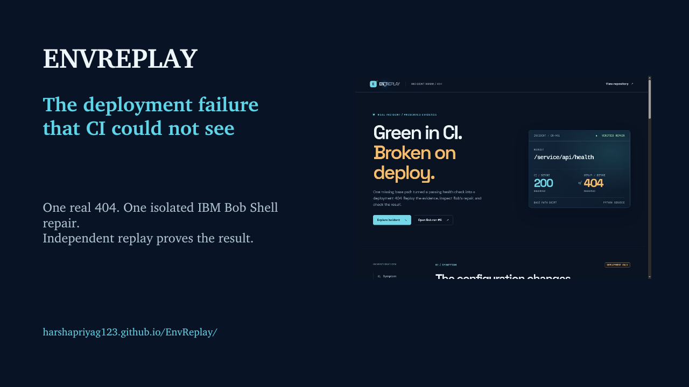
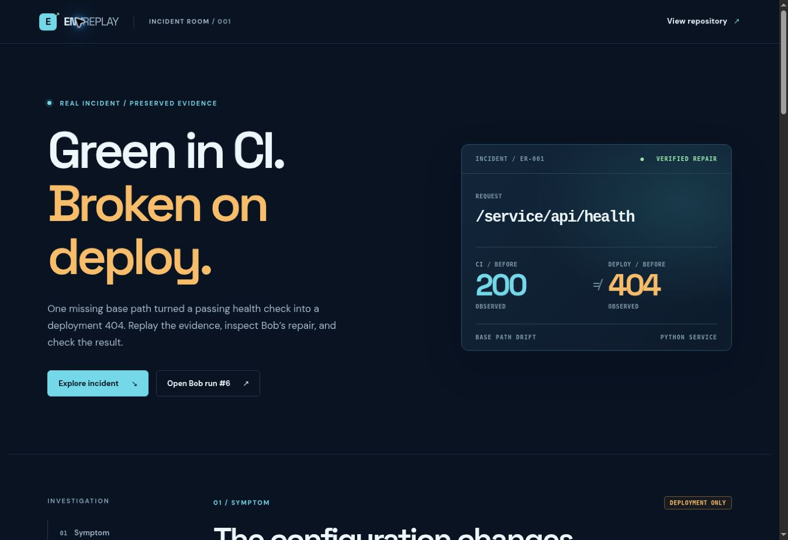
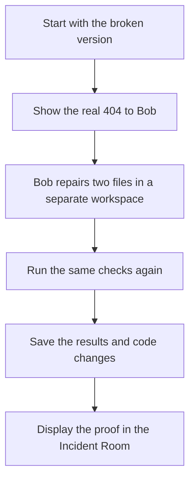
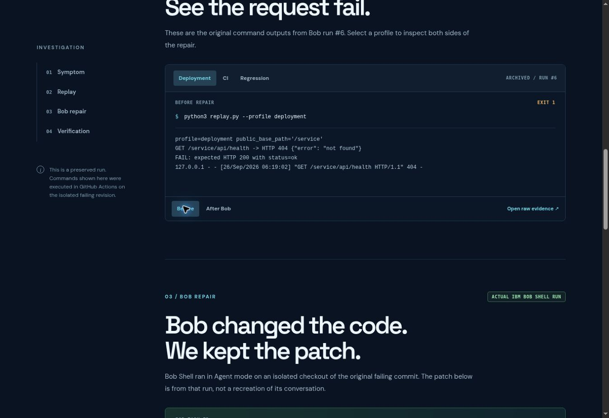
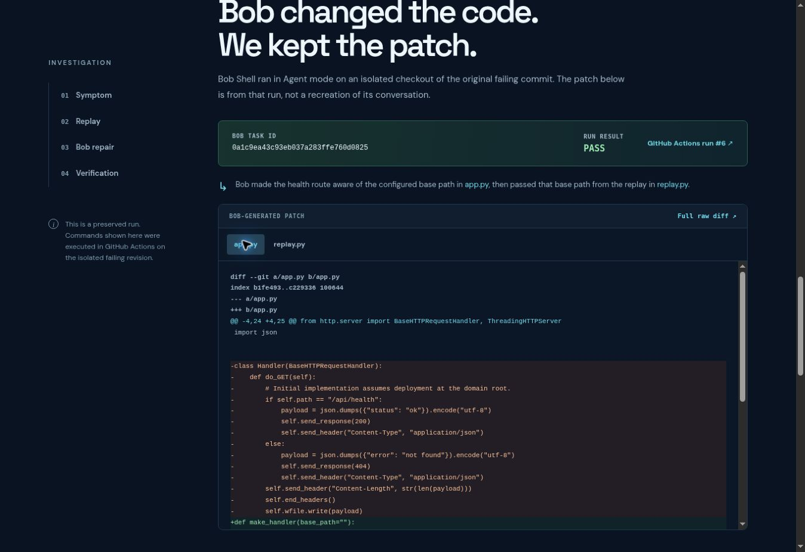
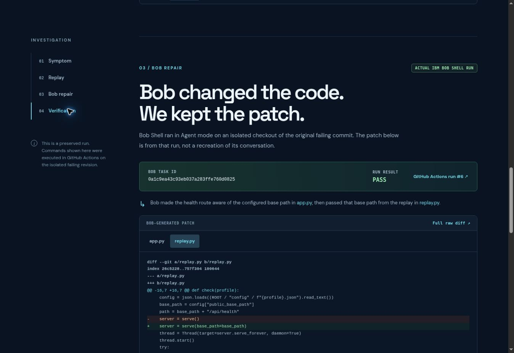

# EnvReplay

### CI passed. The deployed health check returned 404.

**EnvReplay** lets a developer reproduce this mismatch, give the failing evidence to IBM Bob, inspect Bob's code change, and verify the result independently.

[🚀 Launch the Incident Room](https://harshapriyag123.github.io/EnvReplay/) · [🎬 Follow the judge walkthrough](#judge-walkthrough) · [🧪 Reproduce the failure](#run-it-yourself) · [🤖 Inspect Bob's run](https://github.com/harshapriyag123/EnvReplay/actions/runs/36223374110)



## Judge launchpad

Each link opens an actual output or a specific part of the working product. Start with the live page; no account or installation is needed to inspect the saved run.

| Open | What you will see | Result to look for |
| --- | --- | --- |
| 🧭 [**Live Incident Room**](https://harshapriyag123.github.io/EnvReplay/) | The interactive public walkthrough | CI **200** beside deployment **404** on the original revision |
| 🚨 [**Symptom**](https://harshapriyag123.github.io/EnvReplay/#symptom) | Both configuration profiles and request paths | Deployment adds `/service` to the public path |
| ▶️ [**Replay**](https://harshapriyag123.github.io/EnvReplay/#replay) | Captured commands; choose **Deployment**, then **Compare** | The original request returns **404 / exit 1**; after Bob it returns **200 / exit 0** |
| 🤖 [**Bob repair**](https://harshapriyag123.github.io/EnvReplay/#bob) | Bob Shell task ID and tabs for the two changed files | A reviewable patch to `app.py` and `replay.py` |
| ✅ [**Verification**](https://harshapriyag123.github.io/EnvReplay/#verification) | Before/after exit codes; expand the exact commands | CI stays **0**; deployment and regression change from **1 to 0** |
| 📄 [**Raw run report**](evidence/bob-run-6/report.json) | Saved commands and recorded output from run #6 | The same results shown in the interface |

<a id="judge-walkthrough"></a>

### The 90-second judge walkthrough

1. **0:00–0:20 — Open [Symptom](https://harshapriyag123.github.io/EnvReplay/#symptom).** CI asks for `/api/health`; deployment asks for `/service/api/health`. The original service only answers the first request.
2. **0:20–0:45 — Open [Replay](https://harshapriyag123.github.io/EnvReplay/#replay).** Select **Deployment**, then **Compare**. Read the actual failing command, its HTTP 404, and the HTTP 200 after Bob's isolated repair.
3. **0:45–1:05 — Open [Bob repair](https://harshapriyag123.github.io/EnvReplay/#bob).** Inspect the real task ID and switch between Bob's `app.py` and `replay.py` patch tabs. The [Actions run](https://github.com/harshapriyag123/EnvReplay/actions/runs/36223374110) records the Shell execution.
4. **1:05–1:30 — Open [Verification](https://harshapriyag123.github.io/EnvReplay/#verification).** CI stays passing, while deployment and regression change from exit 1 to 0. Expand the commands or open the [raw report](evidence/bob-run-6/report.json) to check the proof.

> [!NOTE]
> The Incident Room shows an **archived Bob Shell run**. It is an interactive evidence viewer, not a live Bob session. The [hackathon guide](https://lablab-ibm-bob-2-hackathon-guide.s3.us.cloud-object-storage.appdomain.cloud/index.html#upload-bob-task-session-summary) separately requires genuine **Bob IDE task-session summaries**. Those files are not in this repository yet.

## What is this, in plain English?

Before software goes live, a service called **CI** runs automated checks. Think of it as a rehearsal. In this project, the rehearsal asks the app for its health at `/api/health` and gets **200**, meaning it worked.

Once deployed, the app sits under `/service`. The health check now asks for `/service/api/health`. The original app does not recognize that address and returns **404**, meaning it cannot find it. Same app, different public address. The rehearsal never tested the address people would use after deployment.

EnvReplay walks through this **one real, repeatable example**. It shows the two addresses, replays the failed request, displays the repair from an IBM Bob Shell run, and checks the repaired version again. You can inspect the exact commands, outputs, and changed code. There are no made-up status numbers in the interface.

> [!IMPORTANT]
> The version on `main` is already repaired and returns 200 for both addresses. That reference repair was written earlier by Codex. IBM Bob Shell separately repaired the original broken version in a temporary workspace. Bob's patch is saved for inspection and was not merged into `main`. The commands below explain how to see the original 404.

## Read more

[📊 Results](#the-problem-at-a-glance) · [🧩 How the repair works](#how-the-repair-works) · [⌨️ Quick start](#run-it-yourself) · [🛠️ Every command](#all-runnable-commands) · [🔎 Evidence and attribution](#evidence-and-attribution) · [🗂️ Files](#repository-map)

## The problem at a glance

| Where the check runs | Address it asks for | Before repair | After Bob's repair |
| --- | --- | ---: | ---: |
| CI rehearsal | `/api/health` | ✅ **200: works** | ✅ **200: works** |
| Deployed app | `/service/api/health` | ❌ **404: missing** | ✅ **200: works** |

The two settings are saved in [the CI and deployment configuration files](config/). The responses are taken from [requests the project actually ran](evidence/bob-run-6/report.json). EnvReplay starts the sample app locally, sends each request, and records what happened.

## Explore the working interface

Open the **[EnvReplay Incident Room](https://harshapriyag123.github.io/EnvReplay/)**. It is a guided tour of the recorded run:

1. **Symptom:** Compare the two addresses and see why only deployment failed.
2. **Replay:** Switch between CI and deployment, then select **Compare** to see the command output before and after Bob.
3. **Bob repair:** Read the recorded task ID and switch between the `app.py` and `replay.py` patch tabs.
4. **Verification:** See the checks run again, expand their complete output, and open the source evidence.

The page is a viewer for saved evidence. Clicking through it does not run a new Bob task or execute Python in your browser.



## How the repair works



1. **Start with the broken version.** The runner opens the [original commit](https://github.com/harshapriyag123/EnvReplay/commit/847f33f7ad3bc3fadbae125e12789e8e097040f0) in a temporary workspace. It confirms that CI passes while deployment fails. If the failure is missing, the experiment stops.
2. **Let Bob investigate.** IBM Bob Shell receives the actual failed output, app code, and configuration. In [recorded run #6](https://github.com/harshapriyag123/EnvReplay/actions/runs/36223374110), Bob changes `app.py` so the health address includes the configured prefix. It changes `replay.py` to pass that setting to the server.
3. **Check the repair separately.** After Bob finishes, EnvReplay runs the requests and tests again. It accepts the result only when Bob changed files and every check passes. It saves the patch for review; nothing is merged automatically.
4. **Make the evidence visible.** The website reads a selected set of saved, public-safe files. Anyone can compare the original failure with the verified result and open the underlying report.

### 1. See the original failure

The deployment request returned 404. Its command exited with code 1, which means the check failed. The CI request still returned 200.



### 2. See what Bob changed

The **Bob repair** section shows the saved patch. You can switch between the two changed files. This screenshot is of the public website displaying Bob Shell evidence; it is not a screenshot of Bob IDE.



### 3. Check that the repair worked

EnvReplay ran the same checks **after Bob finished**. A result of **0** means a command passed; **1** means it failed.

| Check | Command | Before Bob | After Bob |
| --- | --- | ---: | ---: |
| CI replay | `python3 replay.py --profile ci` | 0 | 0 |
| Deployment replay | `python3 replay.py --profile deployment` | **1** | **0** |
| Regression suite | `python3 -m unittest -v` | **1** | **0** |

These values come from [the saved run #6 report](evidence/bob-run-6/report.json). The broken version had two regression tests. The current `main` branch has four, including tests for route separation and invalid paths. The table compares checks run on Bob's temporary workspace; it does not mean Bob's patch was merged into `main`.



## Run it yourself

You can [explore the Incident Room online](https://harshapriyag123.github.io/EnvReplay/) without installing anything. To run the code yourself, you need Python **3.10+** and Git. You only need IBM Bob Shell and an API key if you decide to start a **new** Bob experiment.

Copy these commands into a terminal to check the **already repaired** `main` branch:

```bash
git clone https://github.com/harshapriyag123/EnvReplay.git
cd EnvReplay
python3 replay.py --profile ci
python3 replay.py --profile deployment
python3 -m unittest -v
```

Both address checks should show HTTP 200. All four tests should pass. To see the **original 404**, run this additional command:

```bash
python3 bob_workflow.py prepare
```

This checks an old commit in a temporary workspace without changing your current files. It prints that CI passed while deployment and the old regression suite failed, and saves details in `bob_runs/latest/before.json`. It does **not** start Bob. If you cloned with `--depth`, fetch the missing Git history first.

To open the visual Incident Room on your own computer, run this from the repository root and visit [http://localhost:8000/](http://localhost:8000/):

```bash
python3 site/build.py --check
python3 -m http.server 8000 --directory docs
```

## All runnable commands

The quick start above is enough to see the story. This reference covers every program you can run in the repository, including the optional Bob experiment and website build.

Run these from the repository root unless the row says otherwise.

| Entry point | Command | Result |
| --- | --- | --- |
| CI HTTP replay | `python3 replay.py --profile ci` | Starts a temporary service, requests `/api/health`, and checks HTTP 200 plus `status=ok`. |
| Deployment HTTP replay | `python3 replay.py --profile deployment` | Requests `/service/api/health` using `config/deployment.json`. On `main` it passes; in the original commit it exits 1 with HTTP 404. |
| Regression suite | `python3 -m unittest -v` | Runs the four current route and validation checks. |
| Before/after terminal walkthrough | `python3 demo.py` | Prints the saved original deployment failure, then runs both live profiles and the current regression suite. The **before** output is archived; the **live** checks use your current checkout. |
| Original baseline only | `python3 bob_workflow.py prepare` | Checks out the failing commit temporarily and writes `bob_runs/latest/before.json`. No Bob task starts. |
| Bob repair experiment | `python3 bob_workflow.py run --max-cost 1.0 --max-turns 12 --accept-license` | Requires official Bob Shell, a private `BOB_API_KEY`, and your explicit acceptance of IBM's license. Saves `report.json`, `report.md`, `before.json`, and `bob.diff` under `bob_runs/latest/`. The patch stays isolated. |
| Rebuild public evidence copies | `python3 site/build.py` | Copies allowlisted source evidence and configurations into `docs/data/`. Commit those generated copies if source evidence changes. |
| Check published evidence | `python3 site/build.py --check` | Exits 1 if any published evidence copy differs from its source. |
| Serve Incident Room | `python3 -m http.server 8000 --directory docs` | Opens the static page at `http://localhost:8000/`. |
| JavaScript syntax check | `node --check docs/app.js` | Checks the Incident Room script without starting the site. |
| Direct service | `python3 app.py` | Runs the current server at `127.0.0.1:8080`, using an empty base path by default. Stop with Ctrl+C. |

For the direct service, open another terminal and run `curl http://127.0.0.1:8080/api/health`. To serve it under the deployment prefix, start it with `PUBLIC_BASE_PATH=/service python3 app.py` and request `curl http://127.0.0.1:8080/service/api/health`. Stop the first server before starting another on port 8080. The two `curl` commands are optional; `replay.py` performs these HTTP checks itself on ephemeral ports.

The Bob experiment accepts `--output` for a different report directory and `--bob-bin` for a different Bob executable path. Configure `BOB_API_KEY` privately before running it. Never commit the key or IBM's downloaded key JSON. Review IBM's license before passing `--accept-license`. The noninteractive Bob Shell mode used here pre-approves its tool calls, so review the repository and patch before adapting this runner to other codebases.

### GitHub Actions

| Workflow | Trigger | What it runs |
| --- | --- | --- |
| [Verify EnvReplay](.github/workflows/verify.yml) | Every push and pull request | Both replay profiles, current regression suite, public evidence drift check, and JavaScript syntax check. |
| [Bob repair experiment](.github/workflows/bob-repair.yml) | Manual dispatch | Full-history checkout, official Bob Shell installation, license acceptance gate, isolated repair, and an evidence artifact upload. Requires the `BOB_API_KEY` repository secret. |

The archived [successful Bob run #6](https://github.com/harshapriyag123/EnvReplay/actions/runs/36223374110) is evidence of a past execution. The public page reads a checked-in copy of that run; visiting the page does not start a new workflow.

## Bob's recorded repair

| Evidence | What to inspect |
| --- | --- |
| [GitHub Actions run #6](https://github.com/harshapriyag123/EnvReplay/actions/runs/36223374110) | Official Bob Shell experiment and recorded execution. |
| [Before output](evidence/bob-run-6/before.json) | CI succeeds, deployment and the original regression suite fail. |
| [Complete report](evidence/bob-run-6/report.json) | Commands, actual output, exit codes, changed files, and Bob task ID. |
| [Readable report](evidence/bob-run-6/report.md) | Compact before/after table and result. |
| [Bob-generated patch](evidence/bob-run-6/bob.diff) | Exact isolated changes to `app.py` and `replay.py`. |

Bob Shell task ID: `0a1c9ea43c93eb037a283ffe760d0825`. The runner recorded a successful Bob status **and** an independent `PASS` verdict. Both are inspectable; neither substitutes for reviewing the diff.

## Evidence and attribution

The [reference repair on `main`](app.py) was authored earlier by **Codex at the owner's request**. IBM Bob Shell independently fixed the [original failing commit](https://github.com/harshapriyag123/EnvReplay/commit/847f33f7ad3bc3fadbae125e12789e8e097040f0) in an isolated worktree during run #6. Its patch is preserved as evidence, but it has not been merged into `main`. The Incident Room screenshots document the public product, **not** an IBM Bob IDE conversation.

**Hackathon evidence boundary:** Run #6 proves IBM Bob **Shell** usage. The hackathon [submission guide](https://lablab-ibm-bob-2-hackathon-guide.s3.us.cloud-object-storage.appdomain.cloud/index.html#upload-bob-task-session-summary) separately requires Bob **IDE** as a core component and genuine IDE task-session summary screenshots. None are present in this repository. Do not label Shell logs, website screenshots, or the public interface as IDE task summaries.

This prototype demonstrates one deterministic base path mismatch. It does not claim to discover arbitrary deployment failures. Its value is the traceable sequence from a specific failing request, through an isolated Bob repair, to repeatable verification.

## Hackathon submission materials

These links lead to prepared files. A recording script is not a finished video; the repository does not currently contain an MP4 or genuine Bob IDE task-session screenshots.

| Item | Open | What to use it for |
| --- | --- | --- |
| 🖼️ Cover | [View cover](submission/cover.png) | Project thumbnail for the submission form. |
| 📊 Slides | [Download pitch deck](submission/envreplay-pitch.pptx) | Presentation draft to review and upload. |
| 🎙️ Video | [Open recording guide](submission/video-script.md) | Shot list and narration for an actual screen recording. |
| 📝 Submission copy | [Open prepared answers](submission/submission-copy.md) | Review the problem, solution, and Bob usage statements before submitting. |
| 📋 Checklist | [Open submission kit](submission/README.md) | See remaining evidence and upload steps. |

## Repository map

| Path | Purpose |
| --- | --- |
| [`app.py`](app.py) · [`replay.py`](replay.py) | Python service and real HTTP profile replay. |
| [`config/`](config/) · [`test_regression.py`](test_regression.py) | CI/deployment paths and regression checks. |
| [`bob_workflow.py`](bob_workflow.py) · [`demo.py`](demo.py) | Isolated Bob experiment and terminal walkthrough. |
| [`evidence/bob-run-6/`](evidence/bob-run-6/) | Preserved run output, report, and patch. |
| [`site/build.py`](site/build.py) · [`docs/`](docs/) | Evidence-copy guard and static Incident Room. |
| [`.github/workflows/`](.github/workflows/) | Verification and manual Bob experiment. |
| [`submission/`](submission/) | Draft submission copy, cover, slides, and recording guide. Draft materials do not prove a submission or recorded video. |
